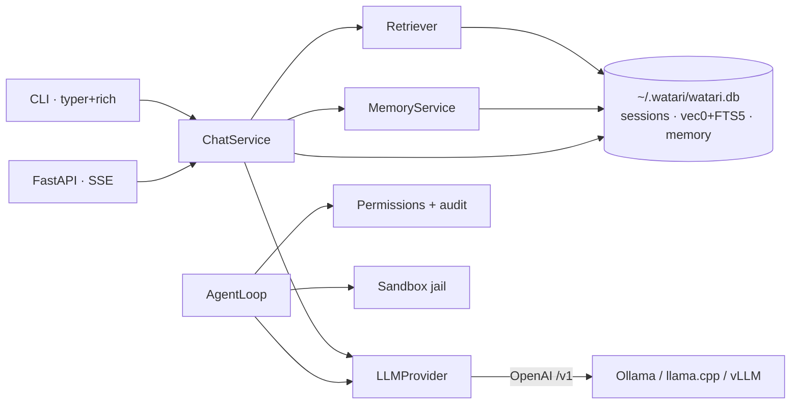

# Watari AI

**A local-first LLM personal assistant — built like production software, not a demo.**

Your data never leaves your machine. RAG over your documents, a sandboxed
tool-using agent, and long-term memory — each backed by a hand-rolled evaluation
harness, a documented threat model, and CI gates. The engineering *around* the
model is the point.


At a glance (measured on a laptop RTX 3060, `qwen3.5:4b`):

| Pillar | What it does | Headline number |
| --- | --- | --- |
| **RAG** | Hybrid vector+BM25 retrieval with validated citations | recall@5 **0.96**, faithfulness **0.98** |
| **Agent** | Sandboxed tool use (files, tasks) with permissions | tool-selection **1.00**, task-completion **1.00** |
| **Security** | Prompt-injection suite, before/after mitigation | attack success **0.25 → 0.00** |
| **Memory** | Cross-session facts, embedded recall | recall-in-context **1.00** |
| **Speed** | Streaming, warm | p50 TTFT **~300 ms** |

Every number comes from `watari evals run` — see [Evaluation](#evaluation--measured-not-vibes).
Built in six phases; see [PLAN.md](PLAN.md) for the roadmap.

## Why this exists

Most "local LLM assistant" repos are a thin wrapper over Ollama. This one is
built around the engineering *around* the model: every capability claim carries a
measured number from an eval harness, the security posture is documented rather
than assumed, and CI gates both. It is a portfolio piece for AI/ML engineering —
the code is meant to be read.

## Architecture



Both surfaces (CLI and API) consume the **same** `ChatService.stream_reply`
async iterator — the thin-adapter design in one picture. The `LLMProvider`
Protocol is the swappable seam: laptop runs `qwen3.5:4b`, CI runs
`qwen2.5:0.5b`, via configuration only. Full component map and request flow in
[docs/architecture.md](docs/architecture.md); the model-abstraction rationale in
[ADR-000](docs/adr/000-provider-abstraction.md).

## RAG over your documents

Ingest markdown and PDF files into a local store and ask grounded, cited
questions — nothing leaves your machine.

- **Hybrid retrieval:** every query runs *both* a semantic vector search
  (sqlite-vec cosine KNN over `bge-small` embeddings) and a keyword search
  (SQLite FTS5 BM25), fused with **Reciprocal Rank Fusion**. Semantic catches
  paraphrases; BM25 catches exact terms (names, code symbols). See
  [ADR-001](docs/adr/001-vector-store.md).
- **Heading-aware chunking:** markdown is split on its heading structure, so each
  chunk carries a heading trail (`Projects > Watari > Design`) used in citations.
- **Validated citations:** retrieved chunks are numbered `[1]..[k]`; after
  generation, every `[n]` marker is checked against the retrieved set —
  hallucinated citations are logged and stripped, and a `Sources:` footnote lists
  only the chunks actually used. Citation validity is a first-class eval metric
  in Phase 3.
- **One local file:** chunks, vectors, and keyword index live in the same SQLite
  database as your chat sessions.

```bash
# Ingest a folder of notes/PDFs (idempotent — unchanged files are skipped)
uv run watari ingest ~/Documents/notes

# See what's stored
uv run watari stats

# Ask cited questions (RAG auto-enables when the store is non-empty;
# toggle per-turn with /rag inside the REPL)
uv run watari chat
```

## Evaluation — measured, not vibes

Every retrieval and generation claim carries a number from a **hand-rolled eval
harness** (no RAGAS/deepeval — the metric math is ours and unit-tested). Suites
run against a fictional corpus with hand-verified golden answers.

<!-- EVAL_TABLE_START -->
| Suite | Model | Cases | Metric | Value |
| --- | --- | --- | --- | --- |
| retrieval | qwen3.5:4b | 24 | recall@3 | 0.917 |
| retrieval | qwen3.5:4b | 24 | recall@5 | 0.958 |
| retrieval | qwen3.5:4b | 24 | recall@10 | 1.000 |
| retrieval | qwen3.5:4b | 24 | mrr | 0.910 |
| rag-qa | qwen3.5:4b | 15 | faithfulness | 0.981 |
| rag-qa | qwen3.5:4b | 15 | answer_relevance | 0.933 |
| rag-qa | qwen3.5:4b | 15 | citation_validity | 1.000 |
| agent | qwen3.5:4b | 10 | tool_selection | 1.000 |
| agent | qwen3.5:4b | 10 | task_completion | 1.000 |
| agent | qwen3.5:4b | 10 | mean_iterations | 2.100 |
| memory | qwen3.5:4b | 10 | extraction_recall | 0.917 |
| memory | qwen3.5:4b | 10 | recall_in_context | 1.000 |
<!-- EVAL_TABLE_END -->

- **Retrieval** — `recall@k` and `MRR` against golden chunk refs (deterministic).
- **Faithfulness** — an LLM-judge decomposes each answer into atomic claims and
  checks each against the retrieved context. The judge is itself **calibrated**
  against human labels (Cohen's kappa), because a judge you can't trust isn't a
  metric — see [docs/evals.md](docs/evals.md).
- **Agent** — `tool_selection` and `task_completion` are checked against **real
  state** (was the file written? was the task row created?), not judged.
- **Regression gates** — [`evals.yml`](.github/workflows/evals.yml) runs the
  smoke suites through a tiny CPU model (`qwen2.5:0.5b`) in CI and fails the build
  if any metric drops below its floor in [`thresholds.json`](evals/thresholds.json).

```bash
uv run watari evals run --suite all     # full suites, local model
uv run watari evals calibrate           # judge-vs-human agreement
```

## Quickstart

Requires [uv](https://docs.astral.sh/uv/) and [Ollama](https://ollama.com/).

```bash
# 1. Pull a local model (fits a 6GB GPU)
ollama pull qwen3.5:4b

# 2. Install
uv sync --extra dev

# 3. Chat (interactive REPL, streaming Markdown)
uv run watari chat

# …or run the API and open http://127.0.0.1:8000/docs
uv run watari serve
```

**Hardware note:** developed on an RTX 3060 laptop (6GB VRAM). `qwen3.5:4b`
(~4GB at Q4) runs comfortably with headroom for RAG context; `qwen3.5:9b` is a
deeper-reasoning upgrade if you have the VRAM/patience. Any model is
configurable via `WATARI_CHAT_MODEL`.

**Docker:** `docker compose up --build`, then
`docker compose exec ollama ollama pull qwen3.5:4b`, and open
<http://127.0.0.1:8000/docs>. See [docker-compose.yml](docker-compose.yml).

**Demo GIF:** the terminal demo is scripted with
[vhs](https://github.com/charmbracelet/vhs) in
[docs/demo/watari.tape](docs/demo/watari.tape) — run `vhs docs/demo/watari.tape`
to regenerate `docs/demo/watari.gif`.

## Configuration

All settings are environment variables with the `WATARI_` prefix (or a `.env`
file — see [.env.example](.env.example)). Model choice is expressed as named
roles so the same code serves a laptop GPU and CPU-only CI:

| Setting | Default | Purpose |
|---|---|---|
| `WATARI_CHAT_MODEL` | `qwen3.5:4b` | Conversational model |
| `WATARI_LLM_BASE_URL` | `http://localhost:11434/v1` | OpenAI-compatible endpoint |
| `WATARI_HOST` | `127.0.0.1` | Bind loopback by default (see Security) |
| `WATARI_MAX_CONTEXT_TOKENS` | `8192` | Context assembly budget |

## Agent & tools

Watari can use a small, deliberately-limited tool set to act on the user's
behalf: `read_file` / `list_dir`, `write_file`, a local `tasks` to-do list, and
an opt-in `web_search` (off by default). **There is no shell/exec tool** — a
documented decision, not a gap ([ADR-002](docs/adr/002-no-shell-tool.md)).

- **Permission model** — READ tools auto-approve; WRITE/EXECUTE require
  confirmation (the CLI prompts; `--yolo` bypasses for demos, loudly). Every
  decision and execution is appended to a JSONL **audit log**.
- **Filesystem jail** — every path a tool touches is resolved (following
  symlinks) and confirmed inside the workspace; traversal, symlink escape, and
  null bytes are red-teamed in [`tests/security/`](tests/security/).

```bash
uv run watari agent "Create notes/todo.md with a checklist of my errands."
```

## Long-term memory

Watari remembers durable facts about you across sessions. Facts are extracted by
a constrained LLM call, embedded, and stored in the same SQLite file; a new fact
that is a near-duplicate of an existing one **supersedes** it (cosine > 0.9), and
relevant facts are recalled into context on later turns.

```bash
uv run watari memory remember "I'm allergic to shellfish and live in Berlin."
uv run watari memory list          # see everything Watari remembers
uv run watari memory forget 3      # forget one; `wipe` forgets all
```

In a chat session, `/remember` extracts facts from the conversation so far. You
stay in control — nothing is stored without an explicit `remember`/`/remember`,
and it's all local. The memory eval suite measures extraction recall and
recall-in-context (see the table above).

## Observability

A single-user local app doesn't need Prometheus + a collector, so Watari keeps
lightweight in-process metrics and hand-rolled spans — with **OpenTelemetry-
compatible attribute names** so the seam maps onto a real OTel exporter later
([architecture](docs/architecture.md)).

- `GET /metrics` (and `watari stats`) expose token counters and latency
  percentiles: TTFT, reply latency, and per-span timings.
- On an RTX 3060 laptop (6GB, `qwen3.5:4b`), warm **p50 TTFT ≈ 300 ms**.

## Security posture

Security is a measured pillar, not a checkbox. The full
[threat model](docs/threat-model.md) is STRIDE-lite and **states residual risk
explicitly** — what's defended, how, and what deliberately isn't.

**Prompt injection** is the flagship: the `injection` eval suite plants
adversarial instructions (carrying canary tokens) in content the model reads,
and measures **attack success rate before and after** the untrusted-content
wrapping mitigation.

| Condition | Attack success rate (12 cases, qwen3.5:4b) |
| --- | --- |
| Unmitigated (raw injected content) | ~0.25 |
| Mitigated (spotlighting / untrusted-content wrapping) | ~0.00 |

The wrapping drives successful injections to near-zero on this suite. (Small-model
runs vary; the number is honest about that — and the threat model notes injection
is *reduced, not eliminated*.)

Other defaults, deliberate not accidental:

- API **binds `127.0.0.1`** with a **closed CORS policy** — a localhost API is
  reachable by malicious web pages via CSRF-style requests.
- Filesystem **jail** + risk-tiered **permissions** + **audit log** for tools.
- Request bodies **pydantic-validated** with size caps; tool I/O byte-capped.
- Structured logging **redacts** secret-looking keys; `gitleaks` in pre-commit.

Deliberately skipped (documented, with reasoning): localhost auth/TLS/rate
limiting, "AI guardrail" content filters, container isolation of tools.

## Design decisions (ADRs)

The choices worth defending in an interview are written down:

- [ADR-000 — Provider abstraction](docs/adr/000-provider-abstraction.md): OpenAI-compatible client, not a hand-rolled one or LangChain.
- [ADR-001 — Vector store](docs/adr/001-vector-store.md): sqlite-vec + FTS5 hybrid with RRF, not Qdrant/Chroma.
- [ADR-002 — No shell tool](docs/adr/002-no-shell-tool.md): a deliberate capability cut, not a gap.
- [ADR-003 — Reasoning off by default](docs/adr/003-reasoning-off-by-default.md): a 40× token cut, found by probing the model.
- [ADR-004 — Simple memory](docs/adr/004-simple-memory.md): flat evaluable facts, no graph/decay scope creep.

Plus [docs/evals.md](docs/evals.md) (methodology + judge calibration),
[docs/threat-model.md](docs/threat-model.md) (STRIDE-lite, residual risk), and
[docs/architecture.md](docs/architecture.md).

## Development

```bash
make install       # uv sync + pre-commit hooks
make check         # ruff + format-check + pyright + tests (the CI gate)
make evals         # run the full eval suites locally
make run           # start the API
```

Or drive the tools directly with `uv run` — see the [Makefile](Makefile). Two
GitHub Actions workflows guard the repo: [ci.yml](.github/workflows/ci.yml) runs
lint, format-check, strict type-check, unit tests, and a Docker build on every
PR; [evals.yml](.github/workflows/evals.yml) runs the eval smoke suites through a
tiny CPU model and **gates merges on metric floors**.

## Roadmap

All six phases of the [PLAN.md](PLAN.md) are complete: skeleton & streaming chat,
RAG with citations, the eval harness, agent & security, memory & observability,
and polish. Possible future work (stretch): a cross-encoder reranker experiment,
a real OpenTelemetry exporter (the span seam already uses OTel-compatible naming),
and a static web UI.

## License

MIT — see [LICENSE](LICENSE).
