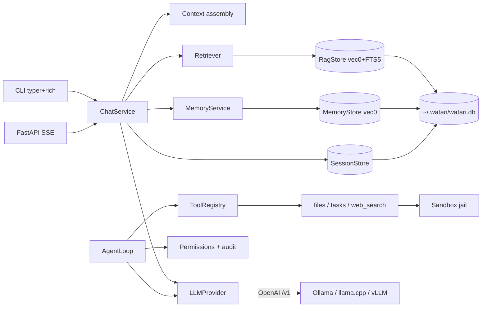

# Architecture

Watari is a local-first LLM assistant. Every capability runs on the user's
machine; a single SQLite file holds all state. This document sketches the
component layout and the key seams.

## Component map

## Seams (the interfaces that matter)

- **`LLMProvider`** — the swappable model boundary. OpenAI-compatible client
  against Ollama; laptop and CI differ only by config. Keeps vendor types out of
  every other layer. ([ADR-000](adr/000-provider-abstraction.md))
- **`RetrieverProtocol` / `MemoryRecaller`** — what `ChatService` depends on for
  RAG chunks and memory facts, so both are mockable in tests.
- **`Embedder`** — fastembed behind a protocol; the same embeddings power RAG
  retrieval and memory dedup/recall, and never touch the GPU.
- **`Sandbox`** — the single choke point every filesystem tool path goes
  through. ([threat model](threat-model.md))

## Data model — one file

`~/.watari/watari.db` holds: `sessions` + `messages` (conversations), `documents`
+ `chunks` + `chunks_fts` + `vec_chunks` (RAG), `memories` + `vec_memories`
(long-term facts), and `tasks`. "Your data is one local file" is both the
privacy pitch and the backup story.

## Observability

Structured logging (structlog) carries `request_id` / `session_id` across async
boundaries from day one. Rather than a full OpenTelemetry SDK + collector — which
has no consumer in a single-user local app — Watari uses a hand-rolled `span()` /
`@traced` abstraction (`obs/tracing.py`) that emits timed spans into the log, and
an in-process `Metrics` registry (`obs/metrics.py`) exposed at `GET /metrics` and
`watari stats`.

**Deliberate OTel compatibility:** span and attribute names follow OpenTelemetry
semantic conventions (`span.name`, `span.status`, `duration_ms`), so the seam
maps 1:1 onto a real OTel exporter if one is ever added — a documented Phase-6
stretch, not a rewrite.

## Request flow (a RAG + memory chat turn)

1. Persist the user message.
2. Recall memory facts (embed query → `MemoryStore` KNN) and, if enabled,
   retrieve RAG chunks (hybrid vector + BM25 → RRF).
3. Assemble context: system prompt + memory block + numbered RAG block +
   token-budgeted history.
4. Stream the completion; record TTFT + reply latency + token usage in metrics.
5. Validate citations, append a `Sources:` footnote, persist the reply.
